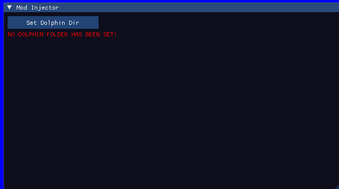
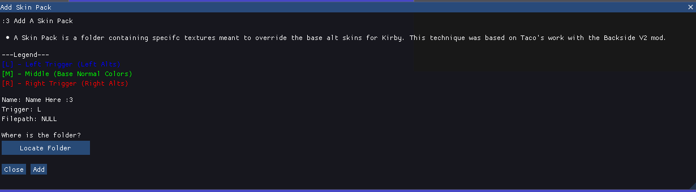

# ORCA
ORCA is a tool for injecting mods into Kirby Air Ride netplay

## How To Use

- Run `ORCA.exe`

- Under the Mod Injector window, click `Set Dolphin Dir` to set the directory containing the Dolphin.exe. ORCA assumes the User settings are local. If a User folder or a `portable.txt` is next to the Dolphin exe, your build is set to local.

    
      
 
 

* The Alt Skin window lists all the loaded Skin Packs. Each Skin Pack is made of a collection of textures meant to override existing textures in the DOL.

    
 
* Click `Add Pack` to add a new Skin Pack as a option.
    
* Click `Locate Folder` and use the Explorer to naviagte to the folder containing the textures for the desired Skin Pack.
    
Once you hit Save, click `Add` in the Add Skin Prompt. This then adds a new Skin Pack to the list.
    
* Each Skin Pack can be enabled or disable. Once you have the Skin Packs you desire. Under the Mod Injector window, press `Inject!!!`. This will override all textures in the custom Dolphin texture folder. When re-injecting Skin Packs, make sure all desired ones are enabled. Disabled ones will not be copied over.
    